# CDT–APIS 双轴稳健模型初步方案

**状态：** 模型级设计草案，不包含实现代码  
**上层研究设计：** `review/journal/dual_shift_design_and_experiment_plan_2026-07-22.md`  
**主模型暂称：** `DualShiftResNet3D`  
**核心模块：** Continuous Demographic Transport（CDT）与 Anatomy-Preserving Imaging Shift（APIS）  

---

## 1. 模型要解决什么问题

给定：

- 3D T1 MRI：\(x\)；
- 人口学表格：\(z=(age, sex, education)\)；
- 训练期采集信息：\(a=(field\ strength, manufacturer, scanner\ model, protocol)\)；
- 诊断标签：\(y\)；

学习诊断模型：

\[
\hat y=f_\theta(x,z)
\]

要求它在以下变化下保持性能：

1. source 与 target 的人口组成不同；
2. scanner、场强和采集协议不同；
3. 人口偏移与成像偏移同时发生；
4. 推理时没有 site/scanner 标签。

模型的关键约束是：

> scanner/site/protocol 只在训练和评估阶段用于构造偏移，不进入最终诊断路径。推理时模型只接收 MRI 与 age/sex/education。

---

## 2. 总体结构

```mermaid
flowchart LR
    X[3D MRI x] --> S[ResNet stem]
    S --> L1[layer1]
    L1 --> A1[APIS-1]
    A1 --> L2[layer2]
    L2 --> A2[APIS-2]
    A2 --> L3[layer3]
    L3 --> L4[layer4]
    L4 --> P[Global pooling]

    Z[age / sex / education] --> ZE[Demographic context encoder]
    ZE --> F[Low-rank tabular fusion]
    P --> F
    F --> H[疾病表征 h]
    H --> C[Classifier]
    C --> Y[clean / shifted logits]

    M[训练期 protocol metadata] --> AE[Acquisition descriptor encoder]
    AE --> PB[Source protocol prototype bank]
    PB --> A1
    PB --> A2

    Y --> LM[Per-subject loss memory]
    Z --> CDT[CDT continuous risk controller]
    LM --> CDT
    CDT --> W[Demographic transport weights]
    W --> JL[Joint clean + APIS risk]
    Y --> JL
```



模型包含三条逻辑路径：

1. **诊断路径**：MRI + age/sex/education → logits；
2. **APIS 路径**：训练期 protocol metadata → 成像偏移特征；
3. **CDT 路径**：人口学变量 + 历史样本风险 → 连续人口迁移权重。

APIS 改变训练时模型看到的成像条件；CDT 改变这些样本在训练目标中的重要性。最终推理路径中不存在 APIS prototype bank、scanner metadata 或 CDT loss memory。

---

## 3. 输入与输出接口

### 3.1 训练输入

```text
image:
    FloatTensor [B, 1, D, H, W]

covariates:
    FloatTensor [B, 3]
    顺序固定为 [age, sex, education]

acquisition:
    categorical:
        manufacturer_id
        field_strength_id
        scanner_model_family_id
        sequence_family_id
    continuous:
        tr_semantic
        te_ms
        ti_ms
        flip_angle
        slice_thickness
        pixel_spacing_x
        pixel_spacing_y
    masks:
        每个字段的 missing indicator

labels:
    LongTensor [B]

subject_ids / sample_ids:
    用于 subject-balanced sampling 和 CDT loss memory
```

### 3.2 推理输入

```text
image:       [B, 1, D, H, W]
covariates:  [B, 3]
```

推理不需要：

- site；
- manufacturer；
- field strength；
- scanner model；
- TR/TE/TI；
- source/target domain label。

### 3.3 训练输出

模型训练态返回结构化结果：

```text
clean_logits
shifted_logits
clean_embedding
shifted_embedding
demographic_embedding
selected_protocol_prototype
shift_strength
per_sample_losses
```

评估态只返回：

```text
logits
embedding（可选）
```

---

## 4. 基础影像编码器

初始版本复用 `JournalResNet3D` 的 ResNet18 主干：

```text
conv1 + BN + ReLU + maxpool
layer1: 32 channels
layer2: 64 channels
layer3: 128 channels
layer4: 256 channels
global average pooling
```

主要调整：

1. 删除现有 late-stage spatial Gamma 作为主路径；
2. 在 `layer1`、`layer2` 后开放 APIS 接口；
3. `layer4` 输出作为疾病表征；
4. pooled image feature 与人口学 embedding 进行低秩残差融合；
5. classifier 同时支持二分类和三分类。

为什么 APIS 放在早期/中期：

- scanner、场强、重建和对比度主要影响低层统计；
- 晚期特征更接近诊断语义，不应直接进行大幅 style transport；
- 在早期改变通道统计能够保持空间位置和宏观解剖结构；
- `layer3/layer4` 可以用于约束偏移前后的疾病证据一致性。

第一版只在 `layer1` 和 `layer2` 使用 APIS，不对 stem、layer3、layer4 做全层搜索。

---

## 5. 人口学上下文编码器

人口学变量既用于 CDT，也直接参与诊断表征学习。

### 5.1 age

- 使用 source-train 均值和标准差进行标准化；
- 使用 8 个固定 RBF centers；
- RBF 输出经两层 MLP 得到 16 维 embedding。

### 5.2 sex

- 统一为 female=0、male=1；
- unknown/missing 单独使用 missing mask，不映射为新的生物类别；
- 使用 8 维 embedding。

### 5.3 education

- 99 等数据字典中的未知编码先转为缺失；
- source train 中位数插补；
- 保留 missing indicator；
- 标准化后使用 8 个 RBF centers；
- 输出 16 维 embedding。

### 5.4 融合方式

拼接三个 embedding 与 missing masks，得到：

\[
e_z\in\mathbb R^{d_z}
\]

不直接把 \(e_z\) 与 pooled MRI feature 简单拼接，而使用 identity-initialized 低秩残差交互：

\[
h_x=\operatorname{Pool}(F_4)
\]

\[
g=\tanh(W_z e_z)
\]

\[
h=h_x+U\left[(Vh_x)\odot g\right]
\]

其中：

- \(V\) 将影像特征投影到低秩空间；
- \(g\) 表示人口学上下文；
- \(U\) 投影回影像特征维度；
- \(U\) 零初始化，因此训练开始时 \(h=h_x\)。

该结构保证：

- 表格变量确实进入最终诊断模型；
- 初始模型等价于 image-only；
- 表格支路不能在初始化时完全覆盖 MRI；
- 可通过 `shuffle covariates` 和 `zero interaction` 进行机制消融。

该低秩融合属于 CDT 的人口上下文部分，不单独包装为第三个创新模块。

---

## 6. 模块一：CDT

### 6.1 CDT 的职责

CDT 不试图从 MRI 中删除 age/sex/education，而是回答：

> source train 中哪些连续人口区域最容易在成像偏移下失效，训练时应当如何提高这些区域的重要性，同时不牺牲某个诊断类别？

传统 GroupDRO 先将 age 分箱，再对 age×sex 离散组优化。当前数据已表明这种方法可能产生稀疏组和单类塌缩。CDT 改用连续核风险面。

### 6.2 为什么不能在 mini-batch 内计算

当前 3D MRI batch size 约为 4。如此小的 batch 无法稳定估计 age/sex/education 邻域，也无法保证每类均有样本。

因此 CDT 不使用 mini-batch 内 GroupDRO，而使用：

> 全 source-train 人口表 + 按受试者维护的 epoch-level loss memory。

### 6.3 Loss memory

为 source train 中每个训练单位保存：

```text
sample_id
subject_id
label
age / sex / education
EMA clean loss
EMA APIS loss
last update epoch
```

每个 epoch 结束后更新：

\[
m_i^{(t)}
=\beta m_i^{(t-1)}
+(1-\beta)
\max\left(
\ell_i^{clean},
\ell_i^{apis}
\right)
\]

CDT 使用 clean 与 APIS 中较困难的风险，因而人口权重会主动关注“在设备偏移下最脆弱的人群”，这构成两个模块的第一层协同。

### 6.4 连续人口核

age 和 education 使用标准化欧氏距离，sex 使用匹配核：

\[
K_{ij}
=K_{age}(z_i,z_j)
\cdot K_{edu}(z_i,z_j)
\cdot K_{sex}(z_i,z_j)
\]

其中：

\[
K_{age}
=\exp\left(
-\frac{(age_i-age_j)^2}{2\sigma_a^2}
\right)
\]

\[
K_{edu}
=\exp\left(
-\frac{(edu_i-edu_j)^2}{2\sigma_e^2}
\right)
\]

\[
K_{sex}=
\begin{cases}
1, & sex_i=sex_j \\
\rho, & sex_i\ne sex_j
\end{cases}
\]

\(\rho>0\) 避免将不同性别完全断开。带宽 \(\sigma_a,\sigma_e\) 只由 source train 确定。

### 6.5 局部风险面

对每个样本：

\[
r_i
=
\frac{
\sum_{j:y_j=y_i}K_{ij}m_j
}{
\sum_{j:y_j=y_i}K_{ij}+\epsilon
}
\]

只在同一诊断类别内估计局部风险，避免某个年龄区域因为 AD 比例更高而天然获得更高权重。

### 6.6 人口迁移权重

每个类别内部：

\[
q_i
=
\frac{\exp(r_i/\tau)}
{\sum_{j:y_j=y_i}\exp(r_j/\tau)}
\]

再加入：

- KL 距离约束；
- 最大单样本权重上限；
- effective sample size 下限；
- 每类总权重相等或按预注册类别先验分配。

有效样本量：

\[
ESS_c=\frac{1}{\sum_{i:y_i=c}q_i^2}
\]

要求：

\[
ESS_c\ge 0.2N_c
\]

若不满足，自动提高温度 \(\tau\)，直到达到约束。

### 6.7 CDT 训练风险

\[
\mathcal L_{CDT}
=
\sum_c\pi_c
\sum_{i:y_i=c}
q_i\ell_i
+\lambda_{KL}
\sum_c KL(q_c\Vert u_c)
\]

其中 \(u_c\) 是类别内均匀分布。

### 6.8 CDT 的更新周期

```text
Epoch 1–5:
    只训练 clean ERM，不启用 CDT

Epoch 6–10:
    更新 clean/APIS loss memory，但 CDT 权重保持均匀

Epoch 11 起:
    每个 epoch 结束后重算一次全训练集人口风险面
    下一 epoch 使用冻结的 CDT 权重
```

不在每个 batch 内即时更新权重，避免小 batch 抖动。

### 6.9 CDT 的必要输出

训练完成后必须导出：

- 每个训练样本的最终 \(q_i\)；
- age×education 连续风险面；
- sex 分层风险面；
- 每类 ESS；
- 最大/最小权重；
- 各 epoch 权重熵；
- 高权重区域的样本量和诊断构成。

如果风险面只集中在极少数样本，CDT 判为失败。

---

## 7. Acquisition Descriptor Encoder

该编码器服务于 APIS，不进入诊断 classifier。

### 7.1 类别字段

| 字段 | 处理 |
|---|---|
| manufacturer | Siemens / GE / Philips / Other / Missing |
| field strength | 1.5T / 3T / Other / Missing |
| scanner model | 归并为 model family，稀有类别合并 |
| sequence family | MPRAGE / IR-FSPGR / SPGR / Other |

每个类别字段使用 embedding，所有映射仅由 source train 构建。

### 7.2 连续字段

- semantic TR；
- TE；
- TI；
- flip angle；
- slice thickness；
- pixel spacing；
- acceleration factor（若可可靠解析）。

每个字段都包含 missing mask。

### 7.3 TR 语义归一

原始 TR 同时出现约 6–9 ms 和 2300–3000 ms，不能直接共同 z-score。

第一版使用：

```text
tr_mode:
    short_cycle  (<100 ms)
    inversion_cycle (>=100 ms)
    missing

tr_value:
    在各自 tr_mode + manufacturer 内标准化
```

后续如果数据字典能够明确区分内部 GRE TR 与完整 inversion TR，再改为两个独立物理字段。

### 7.4 Acquisition embedding

所有类别 embedding、连续值和 missing masks 拼接后经过 MLP：

\[
e_a=E_a(a)
\]

\(e_a\) 只用于：

- 归属 protocol prototype；
- 计算协议距离；
- 选择允许的偏移目标；
- 导出 scanner/protocol 可视化。

---

## 8. 模块二：APIS

### 8.1 APIS 的职责

APIS 回答：

> 在不改变解剖空间结构和诊断标签的前提下，模型对哪些真实存在的 scanner/protocol 特征变化最敏感？

它不生成新的完整 MRI，也不执行无约束对抗攻击。它只在早期特征中迁移与采集条件相关的 channel statistics。

### 8.2 Source-only prototype bank

对 source train 中每个具有足够样本的 protocol domain 建立原型：

\[
p_d=
(\mu_d^{(1)},\sigma_d^{(1)},
\mu_d^{(2)},\sigma_d^{(2)},e_d)
\]

其中：

- \(\mu_d^{(1)},\sigma_d^{(1)}\)：layer1 channel statistics；
- \(\mu_d^{(2)},\sigma_d^{(2)}\)：layer2 channel statistics；
- \(e_d\)：该 domain 的 acquisition embedding 中心。

domain 初始定义：

\[
d=
manufacturer
\times field\ strength
\times model\ family
\times sequence\ family
\]

若某 domain 的训练受试者不足预注册阈值，则逐级回退：

```text
manufacturer × field × model × sequence
→ manufacturer × field × sequence
→ manufacturer × field
→ manufacturer
```

prototype 使用 source train 的指数滑动均值更新，并在每个 epoch 内冻结。

### 8.3 目标 protocol 选择

对样本 \(i\)，只从 source train 已观察到的原型中选择目标 \(d'\)：

- 优先选择与当前 protocol 不同的 field strength 或 manufacturer；
- 协议距离不能超过 source train 中预注册分位数；
- 禁止使用 target cohort 的 protocol 统计；
- 稀有原型不能成为主要扰动目标；
- 同一受试者的其他扫描不作为专用目标原型。

第一版不训练额外的生成器，而是对 2–3 个合法候选原型计算快速困难度分数，再随机选择“困难候选”和“普通候选”，避免 APIS 本身成为第三个复杂对抗网络。

### 8.4 特征统计迁移

设当前层特征为：

\[
F\in\mathbb R^{B\times C\times D\times H\times W}
\]

计算每通道空间统计：

\[
\mu(F),\sigma(F)
\]

向目标 prototype 迁移：

\[
\tilde F
=
\sigma_{d'}
\frac{F-\mu(F)}
{\sigma(F)+\epsilon}
+\mu_{d'}
\]

再使用受限残差插值：

\[
F^{shift}
=(1-\alpha)F+\alpha\tilde F
\]

其中：

- \(\alpha\in[0,\alpha_{max}]\)；
- \(\alpha_{max}\) 由 source validation 确定；
- layer1 和 layer2 分别使用独立 \(\alpha\)；
- 初始 \(\alpha=0\)，保证模型从 clean backbone 开始。

该变换仅修改每通道统计，不改变 \(D,H,W\) 位置，因此天然保持大尺度空间布局。

### 8.5 双路径 forward

训练时同一图像产生：

```text
clean path:
    F1 → F2 → F3 → F4 → clean logits

APIS path:
    shift(F1) → shift(F2) → F3' → F4' → shifted logits
```

共享：

- backbone 参数；
- demographic context encoder；
- classifier。

不使用两个独立 backbone，避免参数量翻倍。

### 8.6 APIS 损失

#### 偏移分类风险

\[
\mathcal L_{shift}
=CE(\hat y^{shift},y)
\]

#### 预测一致性

\[
\mathcal L_{JS}
=JS(
p^{clean}
\Vert
p^{shift}
)
\]

#### 疾病表征一致性

\[
\mathcal L_{feat}
=1-
\cos(
h^{clean},
h^{shift}
)
\]

#### 强度限制

\[
\mathcal L_{strength}
=
\max(0,\alpha-\alpha_{max})^2
\]

第一版不增加 image reconstruction、GAN、frequency decoder 或额外分割网络。

### 8.7 为什么称为 Anatomy-Preserving

该名称基于以下可检验约束，而不是口头假设：

1. 只改变早期 channel statistics，不移动空间位置；
2. clean/shifted 深层疾病表征保持一致；
3. 使用真实 source protocol prototype，限制偏移范围；
4. 在 ADNI 真实 1.5T/3T 配对扫描上检验预测与表征一致性；
5. 如果证据图分析显示疾病区域排序被破坏，则降低 shift strength 或判定 APIS 失败。

---

## 9. CDT 与 APIS 如何真正相互促进

仅同时使用两个模块不等于协同。主模型采用以下双向耦合。

### 9.1 APIS → CDT

CDT 的 loss memory 使用：

\[
m_i
\leftarrow
\max(
\ell_i^{clean},
\ell_i^{APIS}
)
\]

因此，如果某一年龄/性别/教育邻域在 scanner 偏移下明显变差，该邻域会在下一 epoch 获得更高 CDT 权重。

### 9.2 CDT → APIS

APIS loss 按 CDT 权重优化：

\[
\mathcal L_{weighted\ APIS}
=
\sum_i q_i
\left[
\ell_i^{shift}
+\lambda_{JS}\ell_i^{JS}
+\lambda_f\ell_i^{feat}
\right]
\]

因此 APIS 不会平均地增强所有样本，而会优先改善人口风险面中的脆弱区域。

### 9.3 联合目标

\[
\mathcal L_{joint}
=
\sum_i q_i
\left[
\ell_i^{clean}
+\lambda_s\ell_i^{shift}
+\lambda_{JS}\ell_i^{JS}
+\lambda_f\ell_i^{feat}
\right]
+\lambda_{KL}KL(q\Vert u)
\]

### 9.4 防止正反馈失控

两个模块会形成正反馈：APIS loss 越高，CDT 权重越大；权重越大，APIS 越关注该样本。必须加入：

- loss memory EMA；
- CDT 每 epoch 更新一次；
- 最大样本权重上限；
- 每类 ESS 下限；
- APIS \(\alpha_{max}\)；
- 前 10 个 epoch 不启用联合反馈；
- source validation 监控 balanced accuracy、SEN/SPE、Brier；
- 任何类别 recall 低于预注册下限时回退到上一 checkpoint。

---

## 10. 完整训练流程

### Phase 1：Clean warm-up

```text
Epoch 1–5
APIS off
CDT uniform
训练 backbone + demographic fusion + classifier
初始化 clean loss memory
```

### Phase 2：APIS warm-up

```text
Epoch 6–10
建立 source-only prototype bank
开启 APIS，shift strength 从 0 线性增加
CDT 仍保持 uniform
记录 clean/APIS loss memory
```

### Phase 3：Joint training

```text
Epoch 11–50
每个 epoch 开始：
    冻结上一 epoch 的 protocol prototypes
    根据 loss memory 重算 CDT 权重

每个 batch：
    clean forward
    APIS shifted forward
    读取冻结 CDT sample weights
    计算 joint loss
    更新模型参数
    更新 loss memory EMA

每个 epoch 结束：
    更新 source prototype bank
    计算 source validation 指标
    执行 collapse guard
```

### Checkpoint 选择

禁止仅按 overall AUC 选模。source validation 选择分数定义为：

\[
S
=AUC
+0.25\cdot macroF1
-0.10\cdot Brier
-0.10\cdot groupGap
\]

并设置硬约束：

- 二分类 SEN、SPE 均不得低于预注册下限；
- 三分类每类 recall 不得低于预注册下限；
- ECE/Brier 不得同时显著恶化；
- 不满足硬约束的 checkpoint 不参与排序。

具体下限按任务的 source-validation 类别规模在实验协议中冻结，不根据 target 调整。

---

## 11. 评估时的模型行为

正式 target 推理：

```text
model.eval()
APIS disabled
CDT loss memory disabled
input = MRI + age/sex/education
output = logits
```

APIS 不应被错误理解为 test-time adaptation。模型不会：

- 查看 target scanner 分布；
- 使用 target 无标签样本更新 BN；
- 使用 target protocol 生成 prototype；
- 在 target 上重新校准；
- 根据 target 结果调整阈值。

---

## 12. 真实跨场强配对验证

ADNI 的 73 名跨场强受试者不参与 APIS 特殊训练监督。按 split manifest 将其固定到 source validation/test 或独立机制评价集合。

优先评价时间差：

1. ≤30 天；
2. ≤90 天；
3. ≤180 天。

对每对 1.5T/3T MRI 计算：

\[
\Delta p=|p_{1.5T}-p_{3T}|
\]

\[
sim_h=
\cos(h_{1.5T},h_{3T})
\]

以及：

- predicted class agreement；
- paired Brier difference；
- AAL 区域证据排序相关；
- paired bootstrap CI。

比较：

- weighted CE；
- Gamma；
- MixStyle；
- APIS；
- CDT+APIS。

如果 APIS 不能改善真实配对一致性，则不能把 synthetic feature transport 解释为真实 scanner robustness。

---

## 13. 多任务支持

主干和两个模块不依赖类别数量。

### 二分类

- CN vs AD；
- MCI vs AD；
- MCI vs CN。

每个任务分别训练 classifier，正类定义写入配置并冻结。

### 三分类

- CN=0；
- MCI=1；
- AD=2。

CDT 在每个类别内部单独计算风险权重与 ESS。不能只针对 AD 优化人口风险，否则可能牺牲 MCI。

APIS prototype bank 与类别无关，但 APIS 风险按三分类 CE 和每类 recall guard 优化。

第一版不采用一个统一模型同时完成四个任务。四任务共享架构和协议，但分别训练，避免多任务损失成为第三条研究主线。

---

## 14. 模型消融矩阵

| 变体 | 人口融合 | CDT风险面 | APIS | 联合反馈 |
|---|---:|---:|---:|---:|
| Image-only | 否 | 否 | 否 | 否 |
| Table-fusion ERM | 是 | 否 | 否 | 否 |
| GroupDRO | 是 | 离散 | 否 | 否 |
| MixStyle | 是 | 否 | 随机 | 否 |
| CDT-only | 是 | 是 | 否 | 否 |
| APIS-only | 是 | 否 | 是 | 否 |
| CDT+APIS-additive | 是 | 是 | 是 | 否 |
| Full DualShift | 是 | 是 | 是 | 是 |

APIS 内部消融：

- 无 field strength；
- 无 manufacturer/model；
- 无连续 protocol；
- 随机 prototype；
- 无 source-support 限制；
- 仅 layer1；
- layer1+layer2。

CDT 内部消融：

- 离散 age bins；
- 无类别条件归一；
- 无 ESS；
- 无 APIS loss memory；
- age only；
- age+sex；
- age+sex+education。

---

## 15. 计划文件边界

后续实现时建议新建独立目录，避免继续扩大 `journal_resnet.py`：

```text
Model/
  dual_shift/
    __init__.py
    model.py
    backbone.py
    demographic_encoder.py
    demographic_transport.py
    acquisition_encoder.py
    protocol_prototypes.py
    apis.py
    losses.py
    outputs.py
```

职责：

- `model.py`：组合模块并定义 train/eval forward；
- `backbone.py`：开放 layer1/layer2/layer4 接口；
- `demographic_encoder.py`：age/sex/education 编码与低秩融合；
- `demographic_transport.py`：loss memory、核风险、CDT 权重；
- `acquisition_encoder.py`：scanner/protocol 编码；
- `protocol_prototypes.py`：source-only 原型建立、回退和冻结；
- `apis.py`：特征统计迁移；
- `losses.py`：clean、shift、JS、feature、KL 与 joint loss；
- `outputs.py`：结构化 forward 输出。

CDT 的 epoch-level memory/controller 更接近训练协议，但仍放在 `Model/dual_shift` 中定义核心算法；trainer 只负责调用更新接口，不复制算法。

---

## 16. 单元测试边界

必须覆盖：

### Demographic encoder

- 缺失 education；
- unknown sex；
- identity initialization；
- shuffle covariates；
- 二分类/三分类 shape。

### CDT

- 类别内权重和为预期值；
- ESS 约束生效；
- 单类极端 loss 不导致其他类别权重消失；
- batch size=1/4 时仍通过全局 memory 工作；
- split 外 sample ID 被拒绝；
- target sample 不能写入 memory。

### Acquisition encoder

- TR short/inversion mode；
- missing masks；
- unseen category 映射到 unknown；
- source train vocab 冻结。

### APIS

- \(\alpha=0\) 时 shifted feature 等于 clean feature；
- 空间 shape 不变；
- prototype 只来自 source train；
- 无合法 prototype 时安全返回 clean path；
- eval 模式禁用 APIS；
- target metadata 不参与 prototype。

### Joint model

- clean/shifted logits shape；
- 梯度能到达 backbone、demographic encoder 和 APIS；
- CDT 权重不反向传播到 loss memory；
- collapse guard 的触发条件；
- checkpoint 可完整恢复 prototype 和 memory 状态。

---

## 17. 初始超参数边界

以下不是最终最佳值，而是只允许在 source validation 中搜索的预注册小网格：

```text
CDT:
    age bandwidth:        [0.5, 1.0] source-train SD
    education bandwidth:  [0.5, 1.0] source-train SD
    cross-sex rho:        [0.25, 0.5]
    loss EMA beta:        [0.8, 0.9]
    ESS ratio minimum:    0.20

APIS:
    layers:               [layer1, layer1+layer2]
    alpha_max:            [0.25, 0.50]
    prototype min subjects: [8, 16]

Loss:
    lambda_shift:         [0.5, 1.0]
    lambda_JS:            [0.1, 0.5]
    lambda_feature:       [0.05, 0.1]
    lambda_KL:            [0.01, 0.1]
```

第一轮 CN vs AD 只允许该有限网格。选定后冻结到 MCI 与三分类任务，避免按每个 target 反复调参。

---

## 18. 初步 Go/No-Go

### CDT

Go：

- 不复现 SEN/SPE 或三分类 recall 塌缩；
- ESS 始终满足约束；
- 双方向 target AUC 下降不超过 0.01；
- 至少一个方向 macro-F1 或 worst-demographic 明确改善。

No-Go：

- 权重长期集中在极少样本；
- 只改善 source validation；
- 主要收益来自类别阈值偏移；
- 多任务方向不稳定。

### APIS

Go：

- 优于随机 MixStyle；
- 双方向 target AUC 非劣；
- 至少一个方向 macro-F1 或 Brier 改善；
- 真实跨场强配对的预测/特征一致性改善。

No-Go：

- 只提高 synthetic shift 一致性；
- 对真实配对扫描无改善；
- scanner-matched 后优势消失；
- 主要收益来自额外正则而非 protocol-aware prototype。

### Full DualShift

Go：

- 相对 CDT-only 和 APIS-only 至少改善两个预注册维度；
- 3 seeds 中至少 2 个方向一致；
- 不牺牲任一类别 recall 换取总体准确率；
- 通过后才扩展 5 seeds 和全部任务。

No-Go：

- additive 模型与 full joint 模型无差别；
- 一个模块持续主导，另一个无增量；
- 联合反馈造成 loss/weight 振荡；
- 仅一个数据方向有效。

---

## 19. 当前仍需在实现计划中冻结的事项

以下不是模型概念空缺，而是实施前必须用 source 数据审计确定的配置：

1. scanner model family 的合并词典；
2. TR short/inversion mode 的最终解析规则；
3. prototype 最小受试者数采用 8 还是 16；
4. ADNI 跨场强配对子集在各 split 中的固定位置；
5. 诊断转换受试者在四任务 evaluation manifest 中的表示；
6. 每个任务的 recall collapse guard 下限；
7. source validation 的最终组合选模阈值。

这些配置完成后写入实验协议和 split manifest，不得根据 target 结果修改。

---

## 20. 一句话全貌

> `DualShiftResNet3D` 在推理时仍是 MRI+三个人口学变量的轻量 3D 分类器；训练时，APIS 用真实 source scanner/protocol 原型暴露成像脆弱性，CDT 用连续人口风险面放大在这些成像偏移下最脆弱的人群，二者通过受约束的 epoch-level 联合风险相互促进，并用 ADNI 真实跨场强配对扫描和 ADNI↔NACC 双向外测验证。
